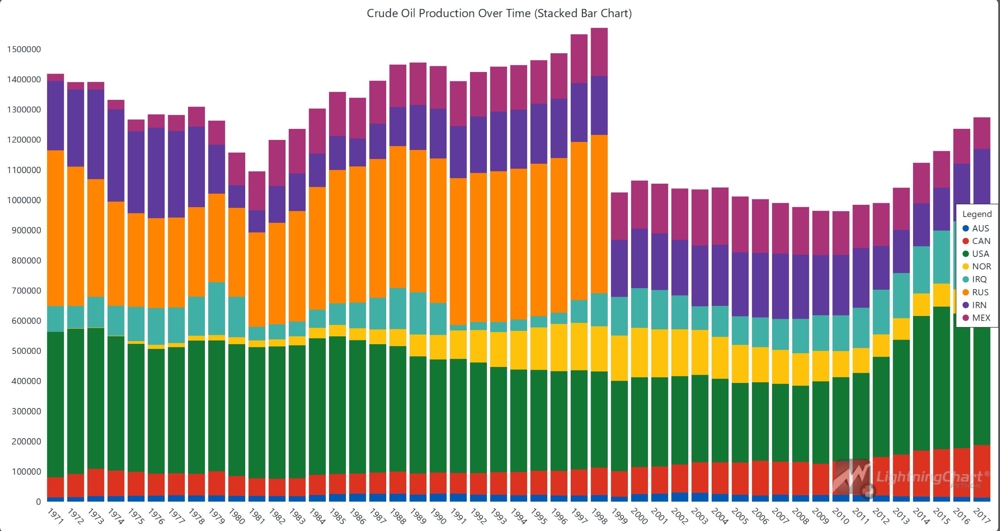
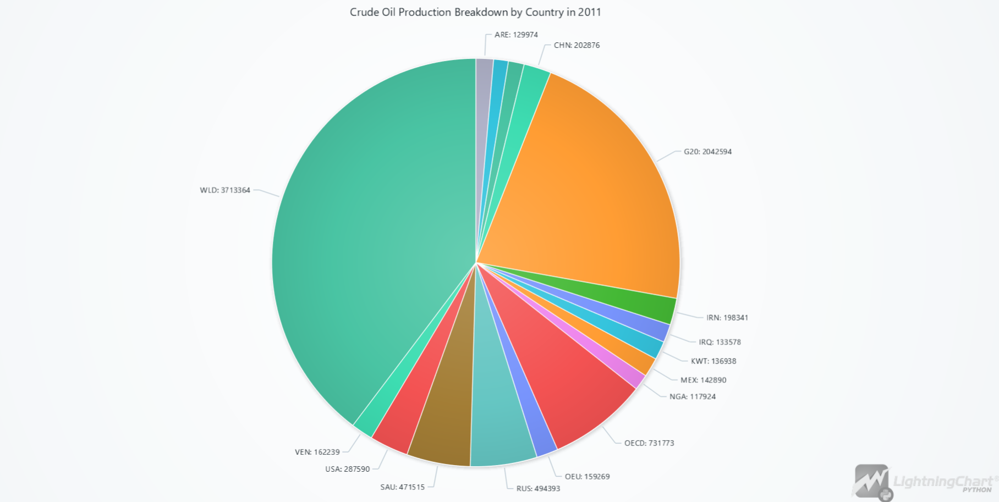
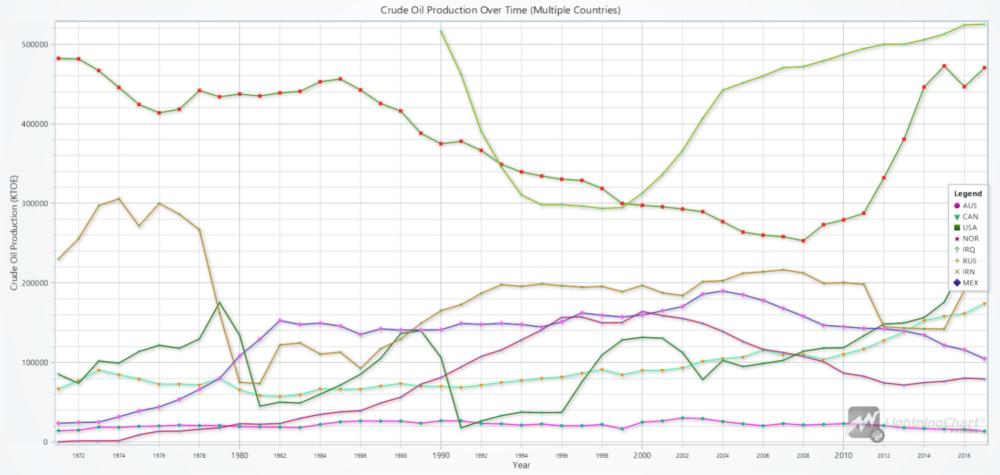
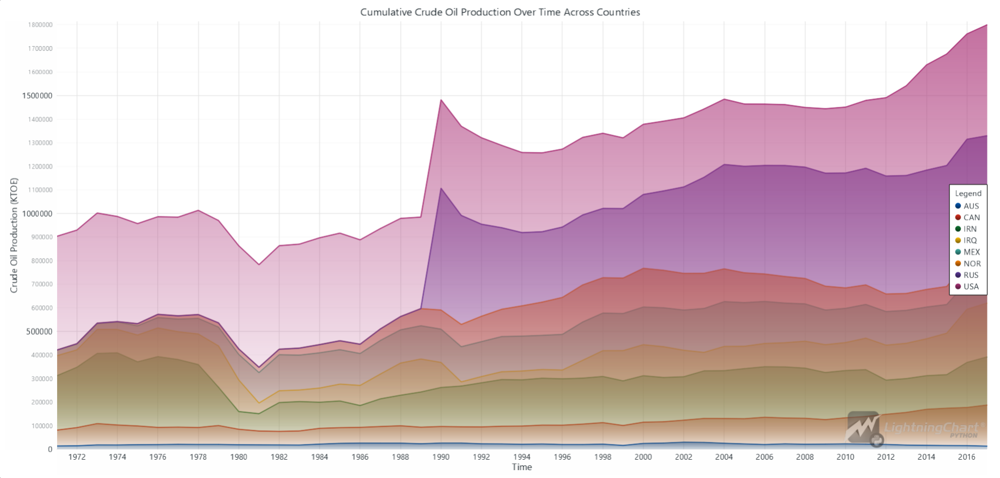
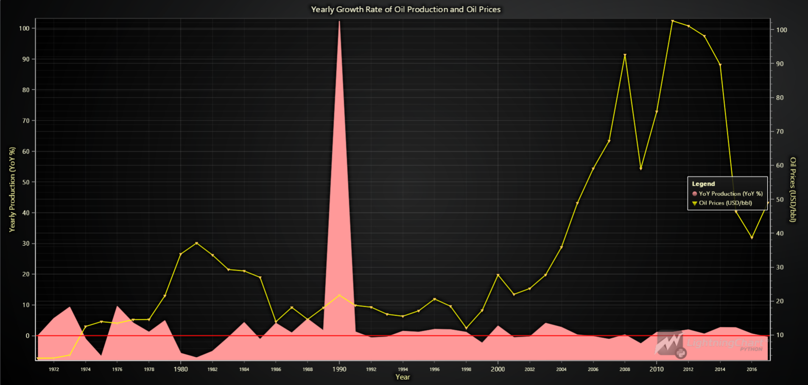

# Crude Oil Production Analysis with LightningChart Python

## Introduction
Crude oil production analysis refers to the study of data related to the extraction of crude oil from the earth, examining production trends, well efficiency, reservoir data, and other key metrics. This analysis is critical for understanding market trends, predicting future production, and optimizing oil extraction processes. With vast datasets generated from various sources, analyzing crude oil production data has become essential for oil companies and governments worldwide.

Python, a powerful programming language known for its vast ecosystem of libraries, has become a go-to tool in the oil and gas industry. The ability to process large datasets, perform statistical analysis, and generate insightful visualizations has made Python invaluable for oil and gas production analytics. Libraries like NumPy, Pandas, and especially LightningChart for Python enable the creation of interactive, high-performance visualizations of oil well production data and barrel production trends.

## Key Data Points in Crude Oil Production Analysis
Crude oil production analysis involves the evaluation of several key variables, including:
- **Production rates**: This metric indicates the amount of oil extracted from wells over time.
- **Well efficiency**: Measures how efficiently a well extracts oil.
- **Reservoir data**: Provides insights into the geological conditions affecting oil extraction.

## LightningChart Python

### Overview of LightningChart Python
LightningChart Python is a high-performance data visualization library designed for demanding data-driven applications. It supports a wide range of interactive and customizable charts, making it perfect for oil and gas production data analysis. It helps data analysts visualize large datasets efficiently, with charts that maintain performance even with millions of data points.

### Features and Chart Types to be Used in the Project
In this project, we leverage several of LightningChart Python’s chart types to comprehensively analyze crude oil production data:
1. **Stacked Bar Charts**: These are used to visualize the contributions of different countries to crude oil production over time. They help us see fluctuations in production levels and determine which countries are the major contributors. 
2. **Line Charts**: Line charts are essential for visualizing trends over time. In this project, they allow us to observe the rise and fall of oil production in different countries from 1970 to 2017. They also help in identifying turning points where significant changes occurred in production patterns. 
3. **Bar Charts**: Bar charts provide an easy-to-interpret visual representation of the production quantities by country in a specific year. This helps in understanding the leading oil producers at any given point in time. 
4. **Pie Charts**: Pie charts give us a clear picture of how production is distributed among different countries in a given year. For example, we used pie charts to visualize crude oil production by country in 2011, providing insights into the market share of each producer. 
5. **Area and Point Line Series**: Area charts combined with point line series are used to visualize cumulative data, such as the total crude oil production over time. This combination allows us to track both individual and combined contributions to oil production in a visually appealing way. 
6. **Map Charts**: LightningChart Python’s map charts enable us to visualize geographical data, such as oil production across the globe. This is particularly useful for showing the spatial distribution of oil production intensity and helping users understand how different regions contribute to global production.

LightningChart’ s ability to handle large datasets efficiently and in real-time makes it an excellent choice for visualizing complex oceanographic data. Its high-performance rendering ensures smooth interactions with even the most data-heavy charts.

### Performance Characteristics

One of the key reasons we chose LightningChart Python for this project is its high performance and ability to handle large datasets. Oil and gas production data can span multiple decades and involve thousands of data points, making performance critical in data visualization tools. LightningChart excels in this area, ensuring smooth, real-time rendering of complex data visualizations without lag, even when handling millions of data points.

Key performance features include:
- **Real-time updates**: LightningChart can process and visualize data as it is received, allowing analysts to monitor oil production metrics in real-time.
- **GPU acceleration**: The library makes use of the GPU to ensure high-speed rendering, especially useful when handling large datasets.
- **Minimal latency**: LightningChart has been optimized for minimal latency, making it ideal for dynamic and interactive visualizations where users can explore the data in real time.

In this project, these performance characteristics allowed us to seamlessly handle decades of oil production data from multiple countries without compromising on speed or interactivity. As a result, LightningChart Python is not only suitable for historical analysis but also for predictive modeling, such as forecasting future oil production trends.

## Setting Up Python Environment

### Installing Python and Necessary Libraries

To get started, ensure you have Python installed. Install the necessary libraries by running the following command:

```bash
pip install lightningchart==0.9.0
pip install numpy pandas statsmodels
```
### Overview of Libraries Used
- **lightningchart**: This is the package for LightningChart in Python, which is correct for installation.
- **numpy**: A core library for numerical operations in Python, which you are using for data manipulation and calculations.
- **pandas**: A popular library for data manipulation and analysis.
- **statsmodels**: This library is used for statistical modeling, which will be useful for time series forecasting, including the ARIMA model.

### Setting Up Your Development Environment

1. **Set up your development environment by creating a virtual environment and installing the necessary libraries. This ensures that your project dependencies are isolated and manageable.
   
   ```bash
   python3 -m venv venv
   source venv/bin/activate  # On Windows use `venv\Scripts\activate`
   pip install -r requirements.txt
   ```

2. **Using Visual Studio Code (VSCode)**: Visual Studio Code is a popular code editor that offers a rich set of features to enhance your development workflow.


## Loading and Processing Data

### How to Load the Data Files

To begin the analysis, you first need to load and preprocess the crude oil production and oil price data. Data can be loaded using common Python libraries like Pandas. For example, you can load CSV or EXCEL data using:

```python
oil_data = pd.read_excel(file_path)
oil_data = oil_data[oil_data['Value'] > 0].dropna(subset=['Value'])
oil_data = oil_data[(oil_data['TIME'] >= 1971) & (oil_data['TIME'] <= 2017)]
oil_data['TIME'] = pd.to_datetime(oil_data['TIME'], format='%Y')

pivot_tide = oil_data.pivot_table(index='TIME', columns='LOCATION', values='Value', aggfunc='sum', fill_value=0)

dashboard = lc.Dashboard(theme=lc.Themes.CyberSpace, rows=2, columns=1)
bar_chart = dashboard.BarChart(row_index=0, column_index=0)
map_chart = dashboard.MapChart(row_index=1, column_index=0)
```
Data preprocessing involves cleaning missing values, normalizing units, and handling outliers to ensure accuracy. After preprocessing, the dataset is ready for visualization.

## Handling and Preprocessing the Data

To prepare the crude oil production and price data for analysis, the following steps were followed:
1. **Loading Data**: The crude oil production and price data were loaded using Pandas, providing efficient manipulation and inspection capabilities.
2. **Filtering and Cleaning**: The production data was filtered to focus only on valid entries (where the production value was greater than 0) and global data ('WLD' for world total). Missing values were dropped to ensure the dataset is complete.
3. **Datetime Conversion**: The 'TIME' column in the production dataset was converted to datetime objects, enabling easy time-series analysis.
4. **Pivoting Data**: The production data was pivoted to aggregate total production by year for a more focused analysis.
5. **Merging Datasets**: The production and oil prices datasets were merged based on the 'Year' column, ensuring that both production and price data are aligned for each year.
6. **Data Preparation for Visualization**: The final merged dataset was prepared for analysis and visualization, providing a comprehensive overview of both production and price trends.

## Visualizing Data with LightningChart

### Introduction to LightningChart for Python

LightningChart provides an efficient way to visualize large datasets in real-time, crucial for applications like solar power modeling.

### Creating the Charts

1. **Stacked Bar Chart (Crude Oil Production Over Time)**: 
The first chart is a stacked bar chart that visualizes crude oil production over time across selected countries. This chart allows for a clear view of how oil production fluctuated between countries over the years. Major producers like the USA and Russia dominate the chart, reflecting their significant contributions to global crude oil output. The stacked format makes it easy to compare total production by year and the distribution among countries.

#### Script Summary:
```python
filtered_data = data[data['LOCATION'].isin(['AUS', 'CAN', 'USA', 'NOR', 'IRQ', 'RUS', 'IRN', 'MEX'])].dropna(subset=['Value'])
x_values = filtered_data['TIME'].dt.strftime('%Y').unique().tolist()

chart = lc.BarChart(vertical=True, theme=lc.Themes.White, title='Crude Oil Production Over Time')
chart.set_sorting('alphabetical')

color_map = {'AUS': '#FF0000', 'CAN': '#00FF00', 'USA': '#0000FF', 'NOR': '#FFFF00', 'IRQ': '#FF00FF',
              'RUS': '#00FFFF', 'IRN': '#800080', 'MEX': '#FFA500'}
stacked_data = [{'subCategory': c, 'values': filtered_data[filtered_data['LOCATION'] ==
                                                            c]['Value'].values.tolist(), 'color': color_map[c]} for c in color_map]

chart.set_data_stacked(x_values, stacked_data).set_value_label_display_mode('hidden').add_legend().set_label_rotation(45)
chart.open()
```


2. **Pie Chart (Crude Oil Production Breakdown by Country in 2011)**:

This pie chart shows the crude oil production breakdown for the year 2011, illustrating the share of each country or organization in the global output. Saudi Arabia, Russia, and the USA are the largest contributors in this specific year. Pie charts are effective for showing relative proportions, and here it highlights the dominance of a few key players in the industry.

#### Script Summary:
```python
filtered_data = oil_data[(oil_data['TIME'] == 2011) & (oil_data['Value'] > 100000)].dropna(subset=['Value'])
countries, production_values = filtered_data['LOCATION'].tolist(), filtered_data['Value'].tolist()

chart = lc.PieChart(title='Crude Oil Production Breakdown by Country in 2011', theme=lc.Themes.Light)
chart.set_slice_stroke(color=lc.Color('white'), thickness=1)

for i, country in enumerate(countries):
    chart.add_slice(name=country, value=production_values[i])

chart.open()
```


3. **Line Chart (Crude Oil Production Over Time for Multiple Countries)**: Reveals the production trends from 1970 to 2017, showing the decline in some countries and steady growth in the USA.

#### Script Summary:
```python
filtered_data = data[data['LOCATION'].isin(country_list)].dropna(subset=['Value'])
filtered_data['TIME'] = pd.to_datetime(filtered_data['TIME'], format='%Y')

chart = lc.ChartXY(theme=lc.Themes.Light, title='Crude Oil Production Over Time (Multiple Countries)')
color_map = {key: lc.Color(np.random.randint(0, 256), np.random.randint(0, 256), np.random.randint(0, 256)) for key in country_list}
point_shapes = ['circle', 'triangle', 'square', 'star', 'arrow', 'plus', 'cross', 'diamond']

for i, country in enumerate(country_list):
    country_data = filtered_data[filtered_data['LOCATION'] == country]
    x_values = [int(datetime(d.year, 1, 1).timestamp()) * 1000 for d in country_data['TIME']]
    y_values = country_data['Value'].tolist()
    
    series = chart.add_point_line_series()
    series.set_point_shape(point_shapes[i % len(point_shapes)]).set_point_size(6).set_line_thickness(2)
    series.set_line_color(color_map[country]).set_name(country)
    series.add(x=x_values, y=y_values)

chart.get_default_x_axis().set_title('Year').set_tick_strategy('DateTime', utc=True)
chart.get_default_y_axis().set_title('Crude Oil Production (KTOE)')
chart.open()
```


4. **Area Chart (Cumulative Crude Oil Production Over Time)**: Visualizes cumulative oil production over time, emphasizing the USA and Russia’s contributions.

#### Script Summary:
```python
filtered_data = data[data['LOCATION'].isin(country_list)].dropna(subset=['Value'])
filtered_data['TIME'] = pd.to_datetime(filtered_data['TIME'], format='%Y')

pivot_tide = filtered_data.pivot_table(index='TIME', columns='LOCATION', values='Value', aggfunc='mean').fillna(method='ffill')
countries = pivot_tide.columns
time_values_ms = [int(t.timestamp()) * 1000 for t in pivot_tide.index]

chart = lc.ChartXY(theme=lc.Themes.White, title='Cumulative Crude Oil Production Over Time Across Countries')

base_area = np.zeros(len(time_values_ms))
for country in countries:
    tide_heights = pivot_tide[country].fillna(0).values
    cumulative_heights = base_area + tide_heights

    series = chart.add_area_series(data_pattern='ProgressiveX')
    series.set_name(country).add(time_values_ms, cumulative_heights.tolist())

    base_area = cumulative_heights

chart.get_default_x_axis().set_title('Time').set_tick_strategy('DateTime')
chart.get_default_y_axis().set_title('Crude Oil Production (KTOE)')
chart.add_legend(data=chart).open()
```


5. **Combination Chart (Yearly Growth Rate of Oil Production and Oil Prices)**: Illustrates the relationship between yearly growth in production and oil prices, highlighting key market trends.

#### Script Summary:
```python
oil_data = pd.read_excel(production_file_path)
oil_data = oil_data[(oil_data['Value'] > 0) & (oil_data['LOCATION'] == 'WLD')].dropna(subset=['Value'])
oil_data['TIME'] = pd.to_datetime(oil_data['TIME'], format='%Y')
pivot_production = oil_data.pivot_table(index=oil_data['TIME'].dt.year, values='Value', aggfunc='sum').reset_index()
pivot_production.columns = ['Year', 'Total_Production']

oil_prices = pd.read_excel(prices_file_path)
merged_data = pd.merge(pivot_production, oil_prices, on='Year', how='inner')
merged_data['YoY_Production'] = merged_data['Total_Production'].pct_change() * 100
merged_data.fillna(0, inplace=True)

chart = lc.ChartXY(theme=lc.Themes.Dark, title="Yearly Growth Rate of Oil Production and Oil Prices")
y_axis_production = chart.get_default_y_axis().set_title("Yearly Production (YoY %)")
y_axis_prices = chart.add_y_axis(opposite=True).set_title("Oil Prices (USD/bbl)")

x_values = [int(datetime(year, 1, 1).timestamp()) * 1000 for year in merged_data['Year']]
series_production = chart.add_area_series().set_name('YoY Production').add(x=x_values, y=merged_data['YoY_Production'].tolist())
series_prices = chart.add_point_line_series(y_axis=y_axis_prices).set_name('Oil Prices').add(x=x_values, y=merged_data['Price'].tolist())

chart.get_default_x_axis().set_title('Year').set_tick_strategy('DateTime', utc=True)
y_axis_production.add_constant_line().set_value(0).set_stroke(2, lc.Color(255, 0, 0))
chart.add_legend().add(series_production).add(series_prices)

chart.open()
```


6. **Forecast Chart (Crude Oil Production Forecast 2018-2027)**: Projects future oil production using an ARIMA model.

#### Script Summary:
```python
oil_data = pd.read_excel(file_path)
oil_data = oil_data[oil_data['Value'] > 0].dropna(subset=['Value'])
oil_data = oil_data[(oil_data['TIME'] >= 1970) & (oil_data['TIME'] <= 2017)]
oil_data['TIME'] = pd.to_datetime(oil_data['TIME'], format='%Y')

pivot_tide = oil_data.pivot_table(index='TIME', columns='LOCATION', values='Value', aggfunc='sum', fill_value=0)

chart = lc.ChartXY(title="Crude Oil Production Forecast (2018-2027)", theme=lc.Themes.Dark)
historical_series = chart.add_point_line_series().set_name("Historical Data")
forecasted_series = chart.add_point_line_series().set_name("Forecasted Data")

def predict_future_production(country):
    model = ARIMA(pivot_tide[country].values, order=(1, 1, 1))
    return model.fit().forecast(steps=10) if country == 'WLD' else [0] * 10

predictions = {country: predict_future_production(country) for country in pivot_tide.columns if country == 'WLD'}

historical_total = [(year, oil_data[oil_data['TIME'].dt.year == year]['Value'].sum()) for year in range(1970, 2018)]
x_historical_values = np.array([datetime(year, 1, 1).year for year, _ in historical_total])
y_historical_values = np.array([total for _, total in historical_total])
historical_series.add(x=x_historical_values, y=y_historical_values)

predicted_total = [(year, sum(predictions['WLD'][year - 2018])) for year in range(2018, 2028)]
x_forecast_values = np.array([datetime(year, 1, 1).year for year, _ in predicted_total])
y_forecast_values = np.array([total for _, total in predicted_total])
forecasted_series.add(x=x_forecast_values, y=y_forecast_values)

chart.open()
```
.png)

7. **Real-Time Dashboard (Historical Crude Oil Production)**: Displays real-time production data and geographical distribution from 1971 to 2027.

#### Script Summary:
```python
def update_charts_for_year(year, data, is_predicted=False):
    title_suffix = 'Predicted' if is_predicted else 'Historical'
    bar_chart.set_title(f'{title_suffix} Crude Oil Production in Year {year}')
    bar_chart.set_data(data)
    map_chart.invalidate_region_values([{"ISO_A3": item["category"], "value": item["value"]} for item in data])

def predict_future_production(country):
    try:
        model = ARIMA(pivot_tide[country].values, order=(1, 1, 1)).fit()
        return model.forecast(steps=10)
    except:
        return [0] * 10  

predictions = {country: predict_future_production(country) for country in pivot_tide.columns if country != 'WLD'}
def update_dashboard(predictions):
    for year in range(1971, 2018):
        year_data = oil_data[oil_data['TIME'].dt.year == year]
        data = [{"category": row['LOCATION'], "value": row['Value']} for _, row in year_data.iterrows() if row['LOCATION'] != 'WLD']
        update_charts_for_year(year, data)
        time.sleep(2)
    for year in range(2018, 2028):
        predicted_data = [{"category": country, "value": predictions[country][year - 2018]} for country in predictions]
        update_charts_for_year(year, predicted_data, is_predicted=True)
        time.sleep(2)

dashboard.open(live=True)
update_dashboard(predictions)
```


## Conclusion
In this article, we demonstrated how to perform a crude oil production analysis using LightningChart Python. By utilizing multiple chart types, we effectively visualized the historical trends, current breakdown, and future predictions of crude oil production across key countries. The analysis began by loading and preprocessing oil production and price data, followed by applying LightningChart’s powerful charting capabilities to represent this data visually. The insights gained from these visualizations help us better understand production trends, price fluctuations, and the global dynamics of crude oil production.
By analyzing data with LightningChart, we highlighted several key patterns, such as the dominance of the USA and Russia in global production, the year-over-year growth rates in relation to oil prices, and predictions for future production trends. This article showcases how LightningChart Python offers a powerful platform for creating high-performance, interactive, and visually appealing data visualizations.


## Benefits of Using LightningChart Python for Visualizing Data

Using LightningChart Python for oil and gas production data analytics offers several benefits, particularly when working with large datasets, real-time data, and intricate visualizations like those required for crude oil production analysis:

- **High Performance**: LightningChart’s ability to handle large datasets efficiently makes it ideal for crude data analysis. Whether working with years of historical production data or real-time data feeds, the performance remains smooth and responsive.
- **Wide Range of Chart Types**: LightningChart supports various chart types that are critical for oil well production analysis. In this project, we used stacked bar charts, line charts, pie charts, area charts, and map charts to offer different perspectives on oil production data.
- **Customization**: The flexibility to customize chart properties, including colors, shapes, and dimensions, allows users to tailor the visualizations to meet their specific analytical needs. This feature is particularly useful when dealing with complex datasets like oil and gas production data.
- **Real-Time Visualization**: The ability to render real-time data was a key feature in this analysis, especially when visualizing live production changes over time. LightningChart allows for dynamic updates and smooth rendering, crucial for monitoring ongoing trends in production.
- **Interactivity and Insights**: LightningChart enhances interactivity by allowing users to explore the data with tooltips, legends, and real-time data updates. This interactive capability helps decision-makers dive deeper into the data for actionable insights.
- **Seamless Integration**: LightningChart integrates well with popular Python libraries like Pandas and NumPy, making it easier to preprocess, manage, and visualize large datasets as seen in this oil barrel production analysis.

Overall, LightningChart Python is an excellent tool for oil and gas production data analysis, enabling professionals in the energy sector to gain valuable insights through powerful and interactive visualizations.
